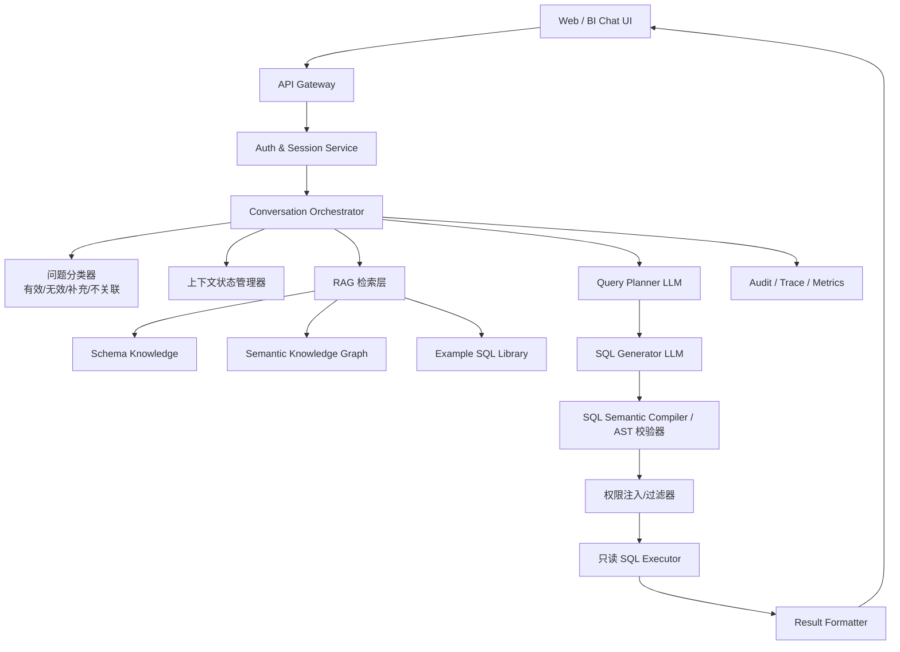

# 面向制造分析场景的 Text2SQL 架构设计（弱规则、强语义层）

## 1. 背景与目标

当前仓库已有两类核心输入：

- `tables.json`：MySQL 业务表结构、字段说明、主键、时间列、版本列、基础关系
- `readme.txt`：补充表间关系和查询语义

目标是建设一个面向 Web 用户的持续对话式 Text2SQL 系统，支持：

- 用户输入自然语言问题
- 自动生成并执行只读 SQL
- 返回结构化结果和自然语言总结
- 支持多轮上下文理解
- 识别无效问题、补充问题、不关联问题
- 实现 Web 账户权限管理
- 采用 `RAG + 示例库 + LLM` 的总体方案

本设计文档重点解决“从业务问题到安全 SQL”的系统化落地，而不是单纯依赖提示词直接生成 SQL。

## 2. 设计原则

### 2.1 核心原则

- `语义层优先`：RAG 只负责召回知识，最终 SQL 必须受语义层、权限层、校验层约束
- `先规划后生成`：LLM 先输出查询计划，再输出 SQL，降低幻觉和错误 Join
- `结构化优先于补丁规则`：优先建设语义对象、中间表示和语义视图，而不是追加 case 规则
- `默认安全`：只允许只读查询，执行范围受语义图和权限层约束
- `会话可控`：多轮对话必须显式维护上下文状态，不能完全依赖模型隐式记忆
- `可审计`：每次检索、分类、SQL、执行耗时、结果条数都要落日志

### 2.2 不建议的方案

不建议直接使用“用户问题 + 全量表结构 + LLM”方式生成 SQL。  
原因是当前数据域存在明显业务约束：

- `FGCODE` 与 `product_ID` 不是单一路径映射，需通过 `product_mapping`
- `Cell / Array / CF` 是生产阶段产品编码
- 不同表的时间粒度不同：日、月、周版本
- 存在 `PM_VERSION`、`plan_month`、`report_month` 等不同时间/版本语义
- 计划、实际、库存、需求属于不同业务域，跨域关联需要明确语义桥接

因此，推荐架构为：

`业务语义层 + 检索层 + 示例层 + LLM 规划/生成 + SQL 语义编译/校验 + 执行层`

## 3. 当前数据域分析

## 3.1 表域划分

### 需求域

- `v_demand`
- `p_demand`
- `sales_financial_perf`

### 库存域

- `daily_inventory`
- `oms_inventory`

### 计划/生产域

- `daily_PLAN`
- `monthly_plan_approved`
- `weekly_rolling_plan`
- `production_actuals`

### 维度与映射域

- `product_attributes`
- `product_mapping`

## 3.2 已知业务语义关系

来自 `readme.txt` 和结构信息，建议沉淀为可计算的语义知识，而不是散落在 prompt 中的规则文本：

- `p_demand`、`v_demand` 的核心业务实体是 `FGCODE`
- `sales_financial_perf` 与需求域共享 `FGCODE` 和客户维度，适合作为需求与业绩对比的结果域
- `daily_inventory`、`oms_inventory` 的核心业务实体是 `product_ID`
- `daily_PLAN`、`monthly_plan_approved`、`production_actuals` 共享计划/实际分析语义，其中前两者偏计划投入，后者同时覆盖实际投入与实际产出
- `product_mapping` 中的 `FGCODE`、`Cell No`、`Array No`、`CF No` 都表示不同阶段的 `product_ID`，用于跨阶段桥接
- `product_attributes` 提供产品分类语义，而不是单纯 Join 目的表

## 3.3 设计约束

这些约束决定了 Text2SQL 不能只靠向量检索：

- 存在横表需求字段：`REQUIREMENT_QTY`、`NEXT_REQUIREMENT`、`LAST_REQUIREMENT`、`MONTH4` 至 `MONTH7`
- 存在多时间粒度：日、月、周版本
- 存在多主业务主键，不同表无法简单按同名字段直接 Join
- 需要通过统一语义视图或中间表示，屏蔽底层编码和粒度差异

## 4. 总体架构



## 4.1 核心服务拆分

### 1. Web 前端

职责：

- 用户登录
- 创建/切换会话
- 展示 SQL、结果表格、摘要、错误信息
- 支持“继续追问”和“开始新话题”

### 2. Auth & Session Service

职责：

- Web 用户认证
- 角色与数据权限管理
- 会话生命周期管理
- 用户与会话绑定

### 3. Conversation Orchestrator

职责：

- 整个查询链路编排
- 调用分类、检索、规划、生成、校验、执行、总结
- 处理失败重试与兜底回复

### 4. 问题分类器

职责：

- 判断有效问题 / 无效问题 / 补充问题 / 不关联问题
- 输出分类标签和置信度
- 决定是否继承上下文

### 5. RAG 检索层

职责：

- 召回相关表结构
- 召回相关语义对象和关系图
- 召回相似问答示例和 SQL 示例

### 6. Query Planner LLM

职责：

- 根据问题、上下文、召回知识生成结构化查询计划
- 明确表、Join、过滤条件、聚合粒度、排序、时间语义

### 7. SQL Generator LLM

职责：

- 将查询计划转换为标准 SQL
- 严格限定只使用计划内表和字段

### 8. SQL AST 校验器

职责：

- 禁止 `INSERT/UPDATE/DELETE/DDL`
- 禁止超范围表和字段
- 检查 SQL 是否可由当前语义图解释
- 检查是否缺失必要过滤
- 自动补充 `LIMIT`

### 9. 权限过滤器

职责：

- 将用户的数据权限转换为 SQL 条件
- 在执行前二次收敛结果范围

### 10. SQL Executor

职责：

- 使用只读数据库账号执行查询
- 设置超时、并发、返回行数上限
- 记录执行元数据

## 5. 推荐的查询处理链路

## 5.1 端到端流程

1. 用户发起问题
2. 根据 `session_id` 读取最近 N 轮会话摘要与上次查询计划
3. 问题分类器判断：
   - 是否有效
   - 是否补充问题
   - 是否与当前会话无关
4. 检索层召回：
   - 相关表结构
   - 相关语义对象、关系边、指标定义
   - 相似问题及高质量 SQL 示例
5. Planner LLM 先输出查询计划 JSON
6. 系统对计划 JSON 做语义约束校验与补全
7. SQL Generator LLM 输出 SQL
8. SQL AST 校验器检查安全与可执行性
9. 注入用户权限过滤条件
10. 执行 SQL
11. 结果格式化并生成自然语言回答
12. 写入审计日志和会话记忆

## 5.2 为什么要先生成查询计划

推荐 LLM 先生成结构化中间表示，而不是一步到位输出 SQL。

建议的计划字段：

```json
{
  "question_type": "new|follow_up|invalid|unrelated",
  "subject": "inventory|demand|plan_vs_actual|sales",
  "tables": ["daily_PLAN", "production_actuals"],
  "join_path": [
    "daily_PLAN.product_ID = production_actuals.product_ID",
    "daily_PLAN.factory_code = production_actuals.FACTORY",
    "daily_PLAN.PLAN_date = production_actuals.work_date"
  ],
  "metrics": ["sum(target_qty)", "sum(Panel_qty)"],
  "dimensions": ["PLAN_date", "factory_code", "product_ID"],
  "filters": [
    {"field": "PLAN_date", "op": "between", "value": ["2026-04-01", "2026-04-30"]},
    {"field": "factory_code", "op": "=", "value": "CELL"}
  ],
  "time_grain": "day",
  "sort": [{"field": "PLAN_date", "order": "asc"}],
  "limit": 200
}
```

这个中间层有三个作用：

- 便于权限注入
- 便于 SQL 校验
- 便于多轮追问继承上次筛选条件

## 6. RAG + 示例库 + LLM 设计

## 6.1 知识库分层

建议不要把所有信息混成一个向量库，而是拆成三层：

### A. Schema Knowledge

来源：

- `tables.json`

内容：

- 表说明
- 字段说明
- 主键
- 时间列、版本列
- 基础关系

### B. Semantic Knowledge

来源：

- `readme.txt`
- 后续人工维护的语义配置、指标定义、映射说明

内容：

- 业务实体及别名
- 表的语义角色
- 可解释的关联边
- 常见指标定义
- 时间/版本解释
- 粒度与口径约束

### C. Example SQL Library

来源：

- 人工沉淀的问答对和标准 SQL

内容：

- 用户问题
- 归一化问题
- 适用表
- 适用业务域
- 标准 SQL
- 使用原因
- 典型变体

## 6.2 检索策略

推荐使用 `结构化语义召回 + 关键词检索 + 向量检索` 的混合模式。

### 第一层：语义候选生成

不是写大量关键词规则，而是把问题先映射为一组语义槽位，再从语义层生成候选域：

- `subject_domain`
- `business_entity`
- `metric_candidate`
- `time_grain`
- `time_scope`
- `version_scope`
- `possible_dimensions`

例如“看 4 月 CELL 工厂实际产出”会先被解释成：

- `subject_domain = production`
- `business_entity = product_ID`
- `metric_candidate = actual_output`
- `time_grain = day or month`
- `time_scope = 2026-04`
- `factory = CELL`

然后再由语义层映射到 `production_actuals` 或相关语义视图，而不是直接靠关键词硬编码表名。

### 第二层：向量/关键词召回

从知识库中召回：

- 相关表定义
- 相关语义定义
- TopK 相似示例

### 第三层：重排

重排依据：

- 语义槽位匹配度
- 实体桥接可解释性
- 时间粒度一致性
- 指标一致性
- 语义图可达性
- 历史成功率

## 6.3 示例库建设建议

示例库是效果上限的关键，建议优先建设。

每条示例至少包含：

- `question`
- `normalized_question`
- `intent`
- `tables`
- `join_path`
- `filters`
- `sql`
- `result_shape`
- `notes`

建议首批先建设 50 到 100 条高频标准问题，优先覆盖：

- 库存查询
- 计划与实际对比
- 月度投入/产出对比
- V/P demand 与 sales/financial 对比
- 单产品、单工厂、单客户、单月份的常见分析

## 7. 语义层设计

RAG 负责“召回”，语义层负责“解释、补全和约束”。

## 7.1 语义层对象

建议维护如下配置：

- `table_catalog`
- `field_catalog`
- `metric_catalog`
- `dimension_catalog`
- `semantic_graph`
- `semantic_views`
- `entity_alias`
- `time_semantics`
- `permission_binding`

## 7.2 当前场景的关键语义对象

### 实体别名

例如：

- “型号” -> `product_ID` 或 `FGCODE`，由所在语义域决定
- “V版需求” -> `v_demand`
- “P版需求” -> `p_demand`
- “实际产出” -> `production_actuals.Panel_qty` 或 `GLS_qty`
- “库存” -> `daily_inventory.TTL_Qty` 或 `oms_inventory.panel_qty`

### 时间语义

例如：

- “今天/昨日” -> 日粒度表
- “本月/月度” -> `report_month` / `plan_month`
- “某版需求” -> 需要带 `PM_VERSION`

### 指标定义

例如：

- “库存量” -> `sum(TTL_Qty)` 或 `sum(panel_qty)`，必须区分数据源
- “计划投入量” -> `sum(target_qty)` 或 `sum(target_IN_glass_qty)`，必须区分表
- “实际产出” -> `sum(Panel_qty)` 或 `sum(GLS_qty)`，必须区分工艺与口径

## 7.3 语义图与关系约束

不建议维护大量 case 级 Join 规则，而是维护一张稳定的语义图，由系统在图中搜索可解释路径。

建议首批语义边：

- `daily_inventory.product_ID = product_attributes.product_ID`
- `oms_inventory.product_ID = product_attributes.product_ID`
- `daily_PLAN.product_ID = product_attributes.product_ID`
- `monthly_plan_approved.product_ID = product_attributes.product_ID`
- `weekly_rolling_plan.product_ID = product_attributes.product_ID`
- `production_actuals.product_ID = product_attributes.product_ID`
- `v_demand.FGCODE = product_mapping.FGCODE`
- `p_demand.FGCODE = product_mapping.FGCODE`
- `sales_financial_perf.FGCODE = product_mapping.FGCODE`
- 当需要生产阶段映射时：
  - `daily_PLAN.product_ID = product_mapping.Cell No|Array No|CF No`
  - `monthly_plan_approved.product_ID = product_mapping.Cell No|Array No|CF No`
  - `production_actuals.product_ID = product_mapping.Cell No|Array No|CF No`

注意：`FGCODE`、`Cell No`、`Array No`、`CF No` 都是不同阶段的 `product_ID`。建议通过语义边类型区分为“成品编码”“阶段编码”“阶段映射”“派生口径”四类，而不是只用一条字符串表达。

## 7.4 面向问答的语义视图

为了进一步减少规则和 token 消耗，建议把复杂底表预处理成少量语义视图。

优先建议：

- `semantic_inventory_view`
  - 统一 `daily_inventory` 与 `oms_inventory` 的常见库存口径
- `semantic_plan_actual_view`
  - 统一 `daily_PLAN`、`monthly_plan_approved`、`production_actuals` 的计划投入、实际投入、实际产出分析口径
- `semantic_demand_perf_view`
  - 统一 `v_demand`、`p_demand`、`sales_financial_perf` 的需求/业绩比较口径
- `semantic_demand_unpivot_view`
  - 将横表需求字段转为标准月份明细，降低 LLM 理解难度

## 8. 多轮对话与问题识别

## 8.1 四类问题定义

### 1. 有效新问题

特点：

- 可以独立理解
- 有明确指标、对象或筛选条件
- 不依赖上文也能执行

示例：

- “查询 2026 年 4 月 CELL 工厂的 daily plan 投入量”

### 2. 补充问题

特点：

- 依赖上一轮上下文
- 省略了主体、时间、工厂、产品等条件
- 常见表达是“再看一下”“换成”“只看”“按客户拆分”“那实际呢”

示例：

- “只看 TV 类产品”
- “换成上个月”
- “那实际产出是多少”

### 3. 不关联问题

特点：

- 虽然可能也是有效数据问题，但与当前会话主题明显切换
- 不应继承上一轮筛选条件

示例：

- 上一轮在查库存，下一轮问“V版需求和财务业绩的差异”

### 4. 无效问题

特点：

- 与数据库无关
- 缺少可识别实体
- 语义严重歧义
- 超出当前知识范围

示例：

- “最近情况怎么样”
- “帮我预测未来走势”
- “公司经营得好吗”

## 8.2 分类实现建议

不要把分类做成大量语言特征规则，建议采用 `会话状态 + 语义差分 + LLM 判定` 组合。

### 输入特征

- 当前问题的语义槽位
- 上一轮 `session_state`
- 当前问题与上一轮查询计划的差分
- 当前问题是否引入新的主体、指标、时间域或业务域
- 当前问题是否缺少独立可执行所需信息

### LLM 输出

LLM 输出：

- `question_type`
- `reason`
- `inherit_context: true/false`
- `context_delta`

示例：

```json
{
  "question_type": "follow_up",
  "inherit_context": true,
  "reason": "用户延续上一轮的计划查询，只新增了产品分类过滤条件",
  "context_delta": {
    "add_filters": [
      {"field": "application", "op": "=", "value": "TV"}
    ]
  }
}
```

其中 `context_delta` 应尽量表达为结构化状态变更，而不是自然语言规则解释。

## 8.3 会话状态建议

每个会话维护一个 `session_state`：

```json
{
  "topic": "plan_vs_actual",
  "tables": ["daily_PLAN", "production_actuals"],
  "dimensions": ["PLAN_date", "factory_code"],
  "filters": [
    {"field": "factory_code", "op": "=", "value": "CELL"},
    {"field": "PLAN_date", "op": "between", "value": ["2026-04-01", "2026-04-30"]}
  ],
  "last_sql": "SELECT ...",
  "last_result_shape": "daily summary"
}
```

后续补充问题只需要修改 `session_state`，而不是重新从零理解所有上下文。

## 9. 权限管理设计

## 9.1 权限目标

系统要同时管理两层权限：

- `Web 账户权限`
- `数据访问权限`

## 9.2 Web 账户权限

建议：

- 使用企业 SSO / OAuth2 / OIDC，或至少使用 JWT Session
- 用户、角色、组织、部门分开建模
- 支持管理员配置角色和数据范围

建议角色：

- `admin`
- `analyst`
- `manager`
- `viewer`

## 9.3 数据权限模型

推荐采用 `RBAC + ABAC` 混合模型。

### RBAC

控制“能不能用这个功能”：

- 是否允许执行 SQL
- 是否允许查看 SQL 文本
- 是否允许下载结果
- 是否允许查看敏感字段

### ABAC

控制“能看哪些数据”：

- 可访问的 `factory_code`
- 可访问的 `SBU_DESC`
- 可访问的 `BU_DESC`
- 可访问的 `CUSTOMER`
- 可访问的产品范围

## 9.4 权限注入位置

权限不能只写在提示词里，必须落到执行链路。

建议三层收敛：

1. `Planner 阶段`
   - 告诉模型当前用户可访问的数据范围
2. `SQL 校验阶段`
   - 如果 SQL 未包含必要权限过滤，直接拒绝或自动补充
3. `执行阶段`
   - 通过权限过滤器注入最终 WHERE 条件

## 9.5 SQL 安全要求

必须实现：

- 只允许 `SELECT`
- 禁止子查询访问未登记到语义层的表
- 禁止 DDL/DML
- 强制超时
- 强制最大返回行数
- 强制审计
- 对敏感字段支持脱敏或不可见

## 10. SQL 生成与校验策略

## 10.1 推荐双阶段生成

### 阶段 1：生成 Query Plan

输出结构化 JSON。

### 阶段 2：根据 Query Plan 生成 SQL

限制：

- 只允许使用计划中的表和字段
- 只允许使用语义图可解释的连接路径
- 只允许使用语义层登记过的指标展开模板

## 10.2 SQL 校验清单

执行前至少检查：

- 是否只包含 `SELECT`
- 是否使用语义层登记的表
- 是否使用语义层登记的字段
- 是否存在不可解释的 Join
- 是否存在笛卡尔积风险
- 是否缺少时间条件导致全表扫描
- 是否缺少权限过滤
- 是否超过行数/复杂度限制

## 10.3 查询失败兜底

失败时不要直接把数据库报错暴露给用户。

建议分三类处理：

- `可修复错误`
  - 例如字段误用、时间列误判，可自动重试一次
- `需澄清错误`
  - 例如“库存”口径不明确，要求用户确认 `daily_inventory` 还是 `oms_inventory`
- `权限错误`
  - 返回“当前账号无权访问该范围数据”

## 11. 存储设计建议

建议至少建设以下元数据表。

### 11.1 账户与权限

- `users`
- `roles`
- `user_roles`
- `data_permissions`

### 11.2 会话与消息

- `chat_sessions`
- `chat_messages`
- `session_state_snapshots`

### 11.3 示例与知识库

- `semantic_tables`
- `semantic_fields`
- `semantic_graph_edges`
- `semantic_views`
- `semantic_metrics`
- `entity_aliases`
- `nl2sql_examples`

### 11.4 审计与追踪

- `query_logs`
- `sql_audit_logs`
- `retrieval_logs`
- `feedback_logs`

## 12. 接口设计建议

## 12.1 核心接口

### 用户侧

- `POST /api/auth/login`
- `POST /api/chat/sessions`
- `GET /api/chat/sessions/{id}`
- `POST /api/chat/query`
- `GET /api/chat/history/{session_id}`

### 管理侧

- `POST /api/admin/examples`
- `POST /api/admin/semantic-graph`
- `POST /api/admin/semantic-views`
- `POST /api/admin/entity-aliases`
- `POST /api/admin/permissions`

## 12.2 `/api/chat/query` 返回建议

```json
{
  "session_id": "sess_001",
  "question_type": "follow_up",
  "sql": "SELECT ...",
  "summary": "2026年4月CELL工厂计划投入量为...",
  "columns": ["PLAN_date", "target_qty"],
  "rows": [],
  "trace_id": "trace_001",
  "used_tables": ["daily_PLAN"],
  "need_clarification": false
}
```

## 13. 推荐技术选型

## 13.1 基础服务

- 前端：`React` 或 `Vue`
- 后端：`FastAPI` / `Spring Boot`
- 会话与元数据存储：`PostgreSQL`
- 业务数据库：`MySQL`
- 缓存：`Redis`

## 13.2 检索层

初期知识规模不大，建议先轻量实现：

- 结构化元数据直接存 PostgreSQL
- 向量检索可用 `pgvector`
- 关键词检索可用 PostgreSQL 全文或 BM25 组件
- 语义层建议直接结构化存储，不进入大段 prompt

如果后续知识规模扩大，再引入独立向量库。

## 13.3 SQL 校验

推荐使用 SQL AST 解析库，而不是字符串规则匹配。

目标：

- 识别表、字段、函数、Join、子查询
- 做语义可解释性校验
- 做自动注入权限条件

## 14. 分阶段实施路线

## 阶段 1：最小可用版

目标：

- 单轮问答
- 只支持少量高频表
- 只支持只读查询

范围：

- 建立语义层配置
- 建设首批语义视图
- 建立示例库
- 支持 `inventory / plan / actual / demand` 四类问题
- 增加 SQL 语义校验

## 阶段 2：多轮会话版

目标：

- 支持补充问题和上下文继承
- 支持无效问题和不关联问题识别

范围：

- 引入 `session_state`
- 增加问题分类器
- 增加澄清问答逻辑

## 阶段 3：权限与治理版

目标：

- 上线真实 Web 用户体系
- 完善审计、限流、超时、回溯

范围：

- 接入 SSO/JWT
- 实现 RBAC + ABAC
- 完善审计日志与告警

## 阶段 4：效果优化版

目标：

- 持续提升 SQL 成功率和业务准确率

范围：

- 引入用户反馈闭环
- 扩充示例库
- 建立失败案例回放机制
- 增加评测集

## 15. 关键风险与应对

### 风险 1：模型乱选表、乱 Join

应对：

- 语义图约束
- Query Plan 先行
- SQL AST 校验

### 风险 2：业务口径不一致

应对：

- 指标定义中心化
- 对“库存量”“实际产出”等词做口径约束
- 必要时发起澄清

### 风险 3：多轮上下文继承错误

应对：

- 显式维护 `session_state`
- 区分 `follow_up` 与 `unrelated`

### 风险 4：权限绕过

应对：

- 执行前注入权限过滤
- SQL AST 校验
- 数据库只读账号

### 风险 5：查询性能差

应对：

- 限制返回行数
- 强制时间过滤
- 对高频查询做缓存
- 对常用维度建立索引或汇总表

## 16. 本项目的最终推荐方案

结合当前仓库规模，推荐先采用以下实现路径：

### 第一优先级

- 将 `tables.json` 和 `readme.txt` 转成结构化语义配置
- 建立首批 `semantic_graph` 和语义视图
- 建立 50+ 条高质量示例 SQL
- 构建 `问题分类 -> 检索 -> Query Plan -> SQL -> 校验 -> 执行` 主链路

### 第二优先级

- 增加 `session_state`
- 支持补充问题
- 支持无效问题和不关联问题识别

### 第三优先级

- 上线 Web 账户与数据权限
- 完成审计、反馈、评测

## 17. 结论

这个场景适合 `RAG + 示例库 + LLM`，但前提是增加一层明确的业务语义层。

如果只做：

- 全量 schema 拼 prompt
- 向量召回若干片段
- 直接让模型生成 SQL

那么在当前这批带有阶段映射、版本语义、时间粒度差异的制造数据上，稳定性会明显不足。

更稳妥的落地方式是：

`语义层 + 混合检索 + 示例库 + Query Plan + SQL 语义编译/校验 + 权限注入 + 持续会话状态`

这套设计既能满足当前需求，也便于后续扩展为企业级可治理的 Text2SQL 平台。
